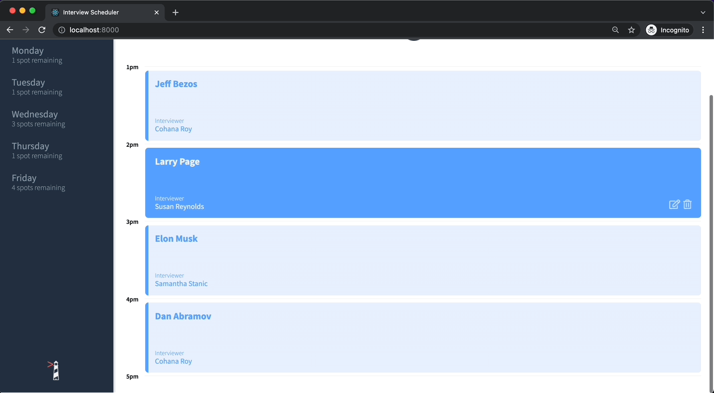
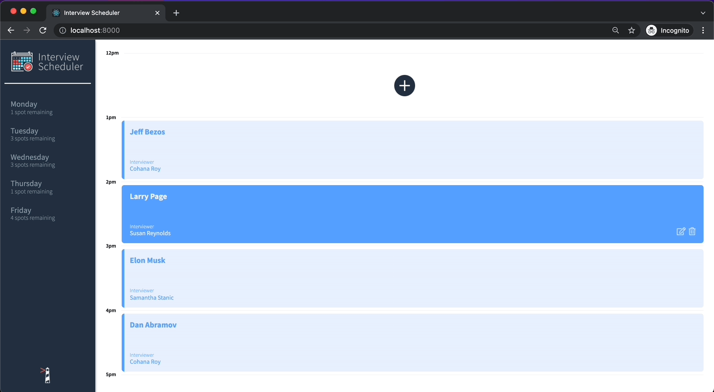
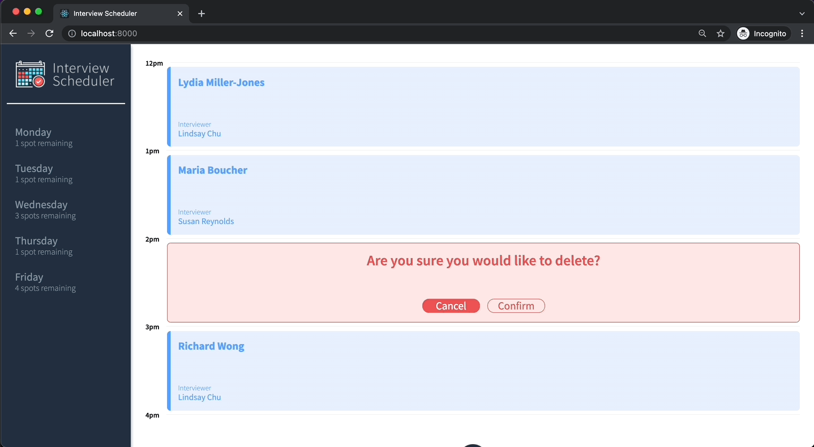
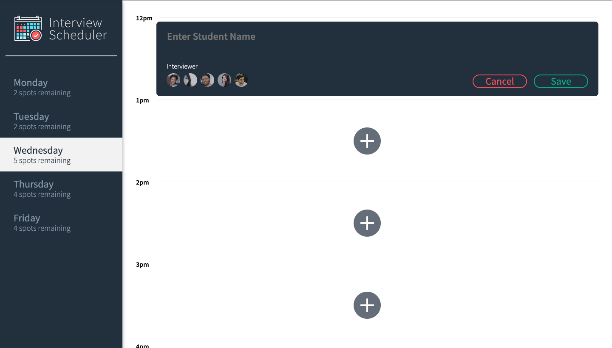
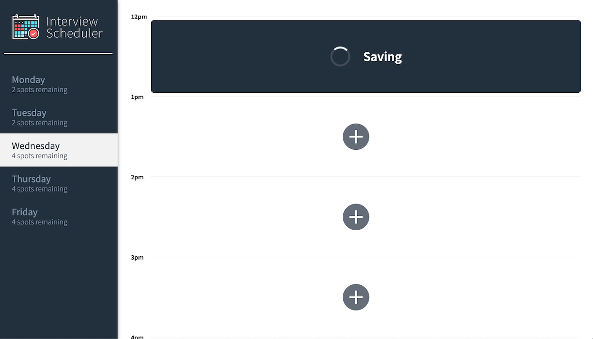
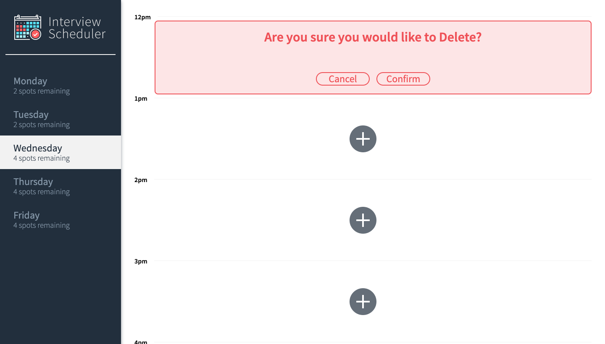
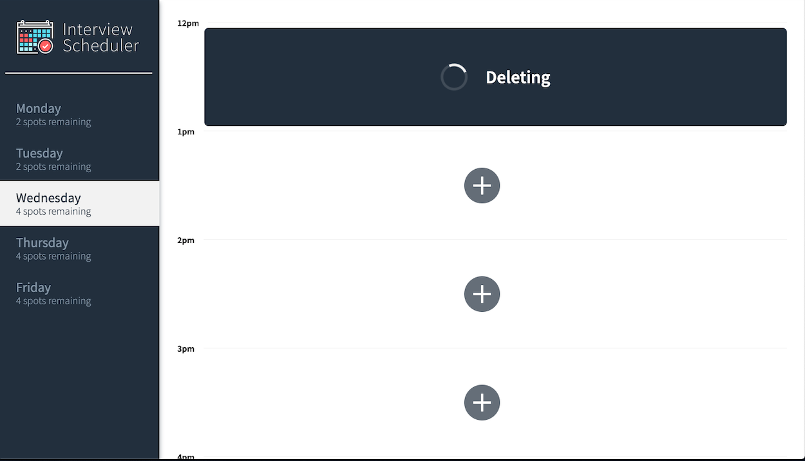
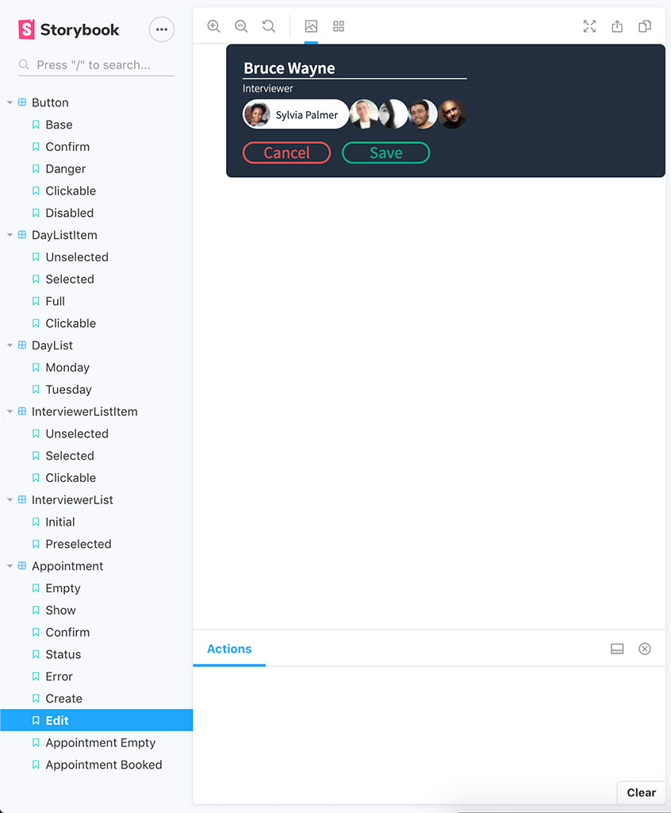

# Interview Scheduler

### About Interview Scheduler

Interview Scheduler is a single-page application (SPA) that allows users to book technical interviews between students and mentors. Appointments can be between the hours of 12 PM and 5 PM, Monday to Friday. Each appointment has one student and one interviewer. When creating a new appointment, the user can enter any student name while the interviewer is chosen from a predefined list. The user can save the appointment and view the entire schedule of appointments on any day of the week. Appointments can also be edited or deleted. The front end of this project is built with React and makes requests to an API to fetch and store appointment data from a database.

### Final Product

## Main page



## Hovering Effect



## Save Interview



## New Interview



## Saving Interview



## Delete Confirmation



## Deleting



## StoryBook



### User Stories

- Interviews can be booked between Monday and Friday.
- A user can switch between weekdays.
- A user can book an interview in an empty appointment slot.
- Interviews are booked by typing in a student name and clicking on an interviewer from a list of available interviewers.
- A user can cancel an existing interview.
- A user can edit the details of an existing interview.
- The list of days informs the user how many slots are available for each day.
- The expected day updates the number of spots available when an interview is booked or canceled.
- A user is presented with a confirmation when they attempt to cancel an interview.
- A user is shown an error if an interview cannot be saved or deleted.
- A user is shown a status indicator while asynchronous operations are in progress.
- When the user presses the close button of the error they are returned to the Form or Show view (skipping Status and Confirm).
- The application makes API requests to load and persist data. We do not lose data after a browser refresh.

## Setup

Install dependencies with `npm install`.

## Running Webpack Development Server

```sh
npm start
```

## Running Jest Test Framework

```sh
npm test
```

## Running Storybook Visual Testbed

```sh
npm run storybook
```

## Tech Stack Used:

### Front-end

- React
- Sass
- CSS

### Back-end

- Axios
- WebSocket
- Node
- Express
- PostgreSQL

### Testing

- Storybook
- Jest
- Cypress
